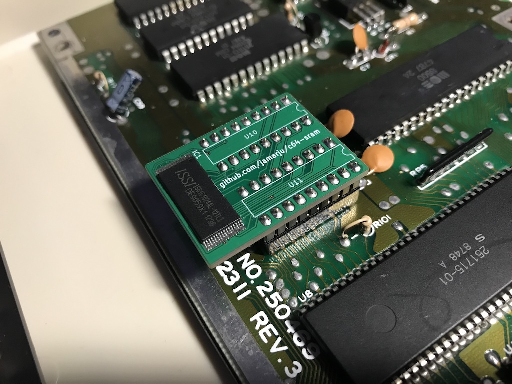
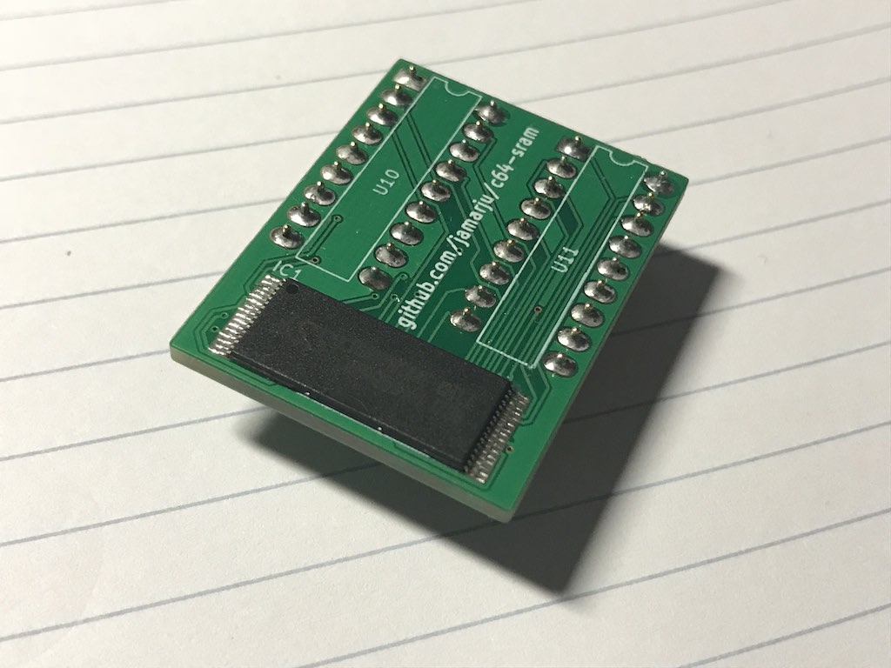
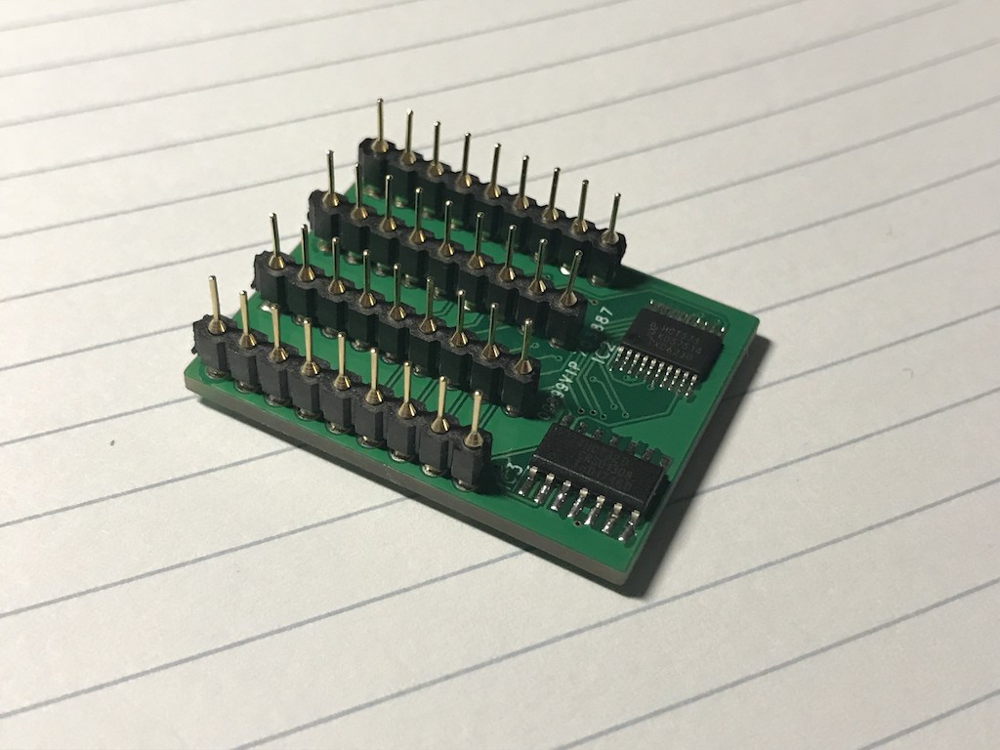

# Commodore 64 (C64C) SRAM replacement

This is a static RAM replacement for C64C (motherboards assy no. 250469).

It is based on [Gerrit4's design, originally posted at the lemon64 forum](http://www.lemon64.com/forum/viewtopic.php?p=773935#773935).

See bom/ and gerber/ if you wish to build your own.

## Thanks

Gerrit4 for the schematic design.
